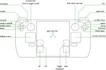

# Steam Deck Native Controls for Minecraft (Java Edition)

This mod gives Minecraft Java Edition native support for the Steam Deck's inputs, bypassing all of Steam Input.
## Features
* Gyro and flick stick camera controls as designed by [Jibb Smart](http://gyrowiki.jibbsmart.com/)
* Twin-stick aiming using left joystick and right trackpad
* Mouse controls for GUIs
* On-screen keyboard using trackpads

## Control mapping

This is hardcoded for now, sorry!

### Non-GUI mode

### GUI mode

## Installation
This is a [Forge](https://minecraftforge.net/) mod. Place the JAR in the `mods/` directory.

You will also need to configure Steam Input to use an empty configuration in order to avoid conflicts.

## How it works

This mod opens the Steam Deck's hidraw device and reads raw input reports (independently / in parallel with anything Steam does). These inputs are injected into Minecraft by calling into the existing keyboard and mouse handler code.
